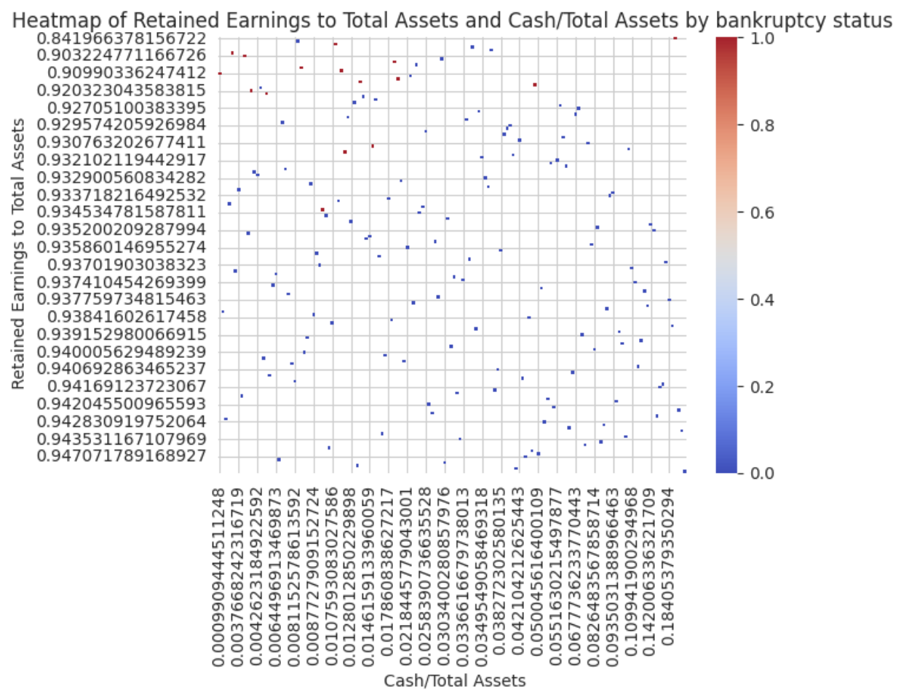

# Bankruptcy Predictor

A single-notebook project that explores machine-learning models to predict corporate bankruptcy using the Taiwan Economic Journal (TEJ) financial ratios dataset (1999–2009). The workflow cleans the data, performs feature selection, and benchmarks several classifiers.

## Contents
- `BankruptcyPredictor.ipynb` — main analysis notebook (copied from Downloads).
- `data.csv` — expected input dataset (not included; see **Data**).
- `requirements.txt` — Python dependencies for the notebook.

## Data
- Source: TEJ corporate bankruptcy dataset (often mirrored on Kaggle as *"Company Bankruptcy Prediction"*). Each row represents a firm-year; target column is `Bankrupt?`.
- Size in notebook run: 6,819 records with 96 columns (95 features + target) after basic cleaning.
- Class balance observed in notebook outputs: 220 bankrupt vs 6,599 non‑bankrupt (~3.2% positive class).

## Workflow (what the notebook does)
1) **Load & clean**: drops duplicates, fills missing values with column means (outlier removal block is present but commented out).
2) **Train/test split**: 80/20 stratified split on features (cols 1–95) vs target (`Bankrupt?`).
3) **Feature selection**: DecisionTree + `GridSearchCV` finds `max_features=26`; top 26 important features are kept. Key ones include:
   - Per Share Net profit before tax (Yuan ¥)
   - Borrowing dependency
   - Quick Ratio
   - Net Income to Stockholder's Equity
   - ROA(B) before interest and depreciation after tax
   - Net Income to Total Assets
   - Interest Coverage Ratio (Interest expense to EBIT)
   - Net Value Growth Rate
   - Operating Profit Rate
   - Net Value Per Share (C)
   - Working Capital/Equity
   - Degree of Financial Leverage (DFL)
   - Quick Asset Turnover Rate
   - Interest-bearing debt interest rate
   - Persistent EPS in the Last Four Seasons
   - Continuous Net Profit Growth Rate
   - Net Value Per Share (B)
   - Operating Expense Rate
   - Research and development expense rate
   - Working Capital to Total Assets
   - Allocation rate per person
   - Inventory Turnover Rate (times)
   - Cash/Current Liability
   - Cash/Total Assets
   - Accounts Receivable Turnover
   - Non-industry income and expenditure/revenue
4) **EDA**: class balance pie chart; scatter of Borrowing Dependency vs Bankruptcy; boxplot of Net Income to Total Assets; correlation heatmaps.
   - Example heatmap (Retained Earnings to Total Assets vs Cash/Total Assets by bankruptcy status):

     
5) **Models benchmarked** (all on the 26 selected features):
   - **KNN + StandardScaler + PCA**
     - 5-fold CV accuracies: [0.9698, 0.9688, 0.9716, 0.9661, 0.9661]; mean 0.9685.
     - Grid search best params: `n_neighbors=10`, `pca__n_components=6` with CV accuracy 0.9712.
   - **RandomForestClassifier** (`n_estimators` grid [50,100,150]):
     - Test classification report: precision/recall/f1 for bankrupt class = 0.82/0.18/0.29; overall accuracy 0.97.
   - **AdaBoostClassifier** (`n_estimators` grid [50,100,150]):
     - Test classification report: precision/recall/f1 for bankrupt class = 0.58/0.41/0.48; overall accuracy 0.97.
   - **DecisionTreeClassifier** (various depths/criteria):
     - Test accuracies around 0.94–0.96; 5-fold CV accuracy ~0.96 ± 0.01.

## How to run
```bash
cd BankruptcyPredictor
python3 -m venv .venv
source .venv/bin/activate
pip install -r requirements.txt
jupyter notebook BankruptcyPredictor.ipynb
```

### MIT License (suggested)
```
MIT License

Copyright (c) 2026 <Your Name>

Permission is hereby granted, free of charge, to any person obtaining a copy
of this software and associated documentation files (the "Software"), to deal
in the Software without restriction, including without limitation the rights
to use, copy, modify, merge, publish, distribute, sublicense, and/or sell
copies of the Software, and to permit persons to whom the Software is
furnished to do so, subject to the following conditions:

The above copyright notice and this permission notice shall be included in all
copies or substantial portions of the Software.

THE SOFTWARE IS PROVIDED "AS IS", WITHOUT WARRANTY OF ANY KIND, EXPRESS OR
IMPLIED, INCLUDING BUT NOT LIMITED TO THE WARRANTIES OF MERCHANTABILITY,
FITNESS FOR A PARTICULAR PURPOSE AND NONINFRINGEMENT. IN NO EVENT SHALL THE
AUTHORS OR COPYRIGHT HOLDERS BE LIABLE FOR ANY CLAIM, DAMAGES OR OTHER
LIABILITY, WHETHER IN AN ACTION OF CONTRACT, TORT OR OTHERWISE, ARISING FROM,
OUT OF OR IN CONNECTION WITH THE SOFTWARE OR THE USE OR OTHER DEALINGS IN THE
SOFTWARE.
```
